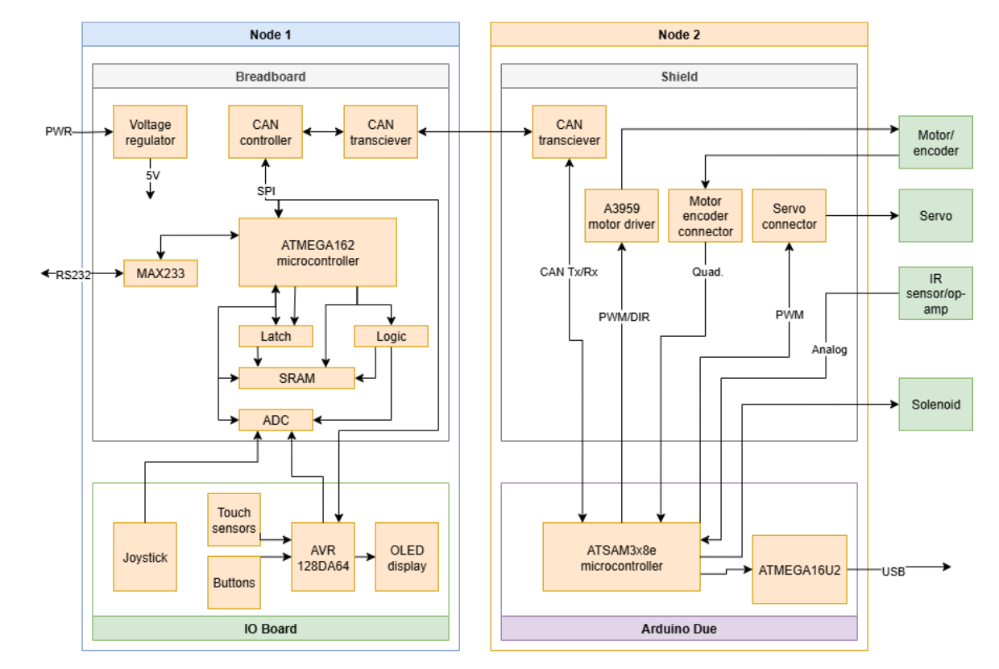

# 🏓 Distributed Pong Embedded Control System

A distributed real-time electromechanical ping pong game developed for:

**TTK4155 – Embedded & Industrial Computer Systems Design (NTNU)**

This project demonstrates a fully distributed embedded control architecture using two interconnected microcontroller nodes communicating over CAN bus.

---

# 📌 System Overview

The system consists of two independent embedded nodes:

## 🧠 Node 1 – ATmega162 (Control & Interface Node)

Responsible for:
- User interface handling
- ADC joystick sampling
- OLED display communication (SPI)
- External SRAM interfacing (XMEM)
- CAN communication (MCP2515)
- Game logic management

### Key Hardware:
- ATmega162 development board
- External SRAM (16 kbit)
- OLED display (SPI)
- MCP2515 CAN controller
- CAN transceiver (MCP2551 / MAX258)
- Joystick module
- Breadboard with NAND logic ICs

---

## ⚙ Node 2 – ATSAM3X8E (Arduino Due) (Actuation Node)

Responsible for:
- PWM motor control
- Servo positioning
- PI control implementation
- Quadrature encoder feedback processing
- IR beam detection
- Relay and solenoid actuation
- CAN communication

### Key Hardware:
- Arduino Due (ATSAM3X8E)
- DC motor + quadrature encoder
- Servo motor
- Relay module
- Solenoid
- IR sensor
- CAN transceiver

---

# 🔌 Communication Architecture

The two nodes communicate via:

- MCP2515 CAN controller (SPI interface on Node 1)
- CAN bus (CAN_H / CAN_L differential signaling)
- Interrupt-driven CAN message handling

The system forms a distributed real-time control network.

---

# ⚡ Control Strategy

A PI controller is implemented on Node 2:

```
u(t) = Kp * e(t) + Ki * ∫ e(t) dt
```

Where:
- e(t) = position error
- Kp = proportional gain
- Ki = integral gain

Encoder feedback provides real-time motor position data.

PWM signals regulate motor speed and servo actuation.

---

# 🔧 Key Technical Concepts Implemented

- External memory interfacing (ATmega162 XMEM)
- Address decoding using NAND gates
- SPI communication (OLED & MCP2515)
- CAN protocol (interrupt-driven communication)
- ADC sampling and joystick calibration
- PWM generation
- PI motor control (Kp & Ki tuning)
- Real-time interrupt handling
- Quadrature encoder processing
- Electromechanical actuation (relay + solenoid)

---

# 🛠 Hardware Requirements

- ATmega162 development board
- Arduino Due (ATSAM3X8E)
- MCP2515 CAN controller
- External SRAM (16 kbit)
- OLED display (SPI)
- Joystick module
- DC motor + encoder
- Servo motor
- Relay module
- Solenoid
- IR sensor
- Breadboard + NAND logic ICs
- CAN transceiver (MCP2551 / MAX258)

---

# 💻 Software Requirements

- avr-gcc toolchain
- ARM GCC (for Arduino Due)
- Make
- avrdude
- openOCD

Development was performed using:
- Linux / macOS terminal environment
- Makefiles for automated build and flashing
- Low-level embedded workflow (no Arduino IDE)

---

# 📁 Project Structure

```
.
├── node1/              # ATmega162 firmware
├── node2/              # ATSAM3X8E firmware
├── presentation/       # Project presentation files
├── build/              # Build artifacts (ignored)
├── .gitignore
└── README.md
```

---

# 🚀 Build, Flash and Run

## Node 1 – ATmega162

Compile:
```
make
```

Flash:
```
make flash
```

Flashing tool:
- avrdude

---

## Node 2 – ATSAM3X8E (Arduino Due)

Compile:
```
make
```

Flash:
```
make flash
```

Flashing tool:
- openOCD

---

# ▶ Running the System

1. Connect both nodes to the CAN bus.
2. Ensure CAN_H and CAN_L are correctly wired.
3. Power both boards.
4. Open serial monitor if debugging.
5. Use joystick to navigate menu.
6. Start game.

---

# 🎮 User Guide

- Joystick controls paddle position.
- OLED displays menu and game state.
- DC motor position is regulated via PI controller.
- Encoder provides real-time feedback.
- IR sensor detects scoring.
- Relay activates solenoid for mechanical interaction.

---

---

## 🖼 System Architecture



---

## 📑 Presentation

[Download Full Presentation (PDF)](presentation/TTK4155_Pong_Presentation.pdf
)

---

## 🎥 Demonstration Video

[Watch the Demo Video on YouTube](https://youtu.be/vGaRm5OW-wA?si=CVA9CVIzg9m92qcd)

---

## 👥 Team Members & Contributions

### Samrath Singh Chhabra – System Architecture & Lead Developer
- Designed overall distributed system architecture  
- Implemented CAN communication (MCP2515 + SPI)  
- Implemented external SRAM (XMEM) and address decoding  
- Developed ADC joystick calibration and OLED interface  
- Implemented PWM and PI motor control with encoder feedback  
- Integrated relay, solenoid, and full system testing  

### Selma Ruud Landmark – Embedded Software & Testing
- Assisted with SPI and CAN communication testing  
- Contributed to firmware debugging and validation  
- Supported hardware wiring and integration  
- Assisted in documentation and presentation  

### Ingrid Skålnes Strømme – Hardware & Validation
- Contributed to hardware assembly and mechanical setup  
- Assisted with motor, IR sensor, and actuator testing  
- Supported documentation and final validation  

---

# 🏁 Conclusion

This project demonstrates:

- Distributed embedded systems design
- Real-time interrupt-driven communication
- Low-level hardware interfacing
- Closed-loop motor control
- Multi-node CAN architecture
- Complete electromechanical system integration

The final result is a fully functional distributed embedded pong game built entirely using low-level embedded programming and real-time control principles.
